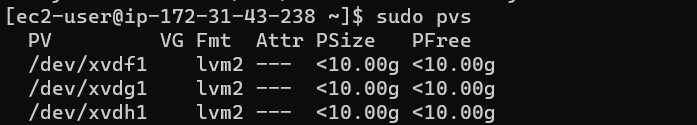

# WEB SOLUTION WITH WORDPRESS

Scope: to prepare storage infrastructure on two Linux servers and implement a basic web solution using Wordpress


## SET UP A WEB SERVER

1. Create an EC2 instance with RedHat Server in AWS and name is "Web Server"


2. Follow the steps in this [video](https://www.youtube.com/watch?v=HPXnXkBzIHw) to add 3 EBS volumes of 10GB to your Web Server. 

    Open your terminal and use `lsblk` to confirm that the volumes have been added. These will likely be named `xvdf, xvdg, xvdh`

    


3. Create a single partition on each of your three block devices using `gdisk` command

   For example to create a single partition on disk xvdg use `sudo gdisk /dev/xvdg` like in the image below then check that the partitions have been created with `lsblk`
   
   


4. Install **lvm2** package using `sudo yum install lvm2`


5. Create a physical volume (PV) on each of the 3 partitions

    ```
    sudo pvcreate /dev/xvdf1
    sudo pvcreate /dev/xvdg1
    sudo pvcreate /dev/xvdh1
    ```


6. Run `sudo pvs` to verify that the PV has been created

    


7. Use `vgcreate` to add all 3 PVs to a volume group (VG) that you will name **webdata-vg**

    `sudo vgcreate webdata-vg /dev/xvdh1 /dev/xvdg1 /dev/xvdf1`


8. Verify that the VG has been created with `sudo vgs`

    


9. Create two logical volumes (LV) that will be half size webdata-vg and name them:

    -**apps-lv** : to store data from the Website 

    -**logs-lv** : to store data for logs

    ```
    sudo lvcreate -n apps-lv -L 14G webdata-vg
    sudo lvcreate -n logs-lv -L 14G webdata-vg
    ```

10. Verify your complete setup with `sudo vgdisplay -v` or
`lsblk`

    


11. Format your LVs with **ext4** filesystem

    ```
    sudo mkfs -t ext4 /dev/webdata-vg/apps-lv
    sudo mkfs -t ext4 /dev/webdata-vg/logs-lv
    ```

12. Create **/var/www/html** directory as mount point for **apps-lv**. This directory will store website files.

    ```
    sudo mkdir -p /var/www/html
    sudo mount /dev/webdata-vg/apps-lv /var/www/html/
    ```

13. Create backup directory for log files 

    `sudo mkdir -p /home/recovery/logs`


14. Backup all log files in the **/var/log** directory into **/home/recovery/logs** (this ensures that the data in /var/log will not be lost and is a "must-do" because of the next step)

    `sudo rsync -av /var/log/. /home/recovery/logs/`


15. Mount **logs-lv** on **/var/log** 

    `sudo mount /dev/webdata-vg/logs-lv /var/log` (this deletes all previous data in /var/log)


16. Restore log files back into **/var/log** directory

    `sudo rsync -av /home/recovery/logs/. /var/log`


### UPDATE THE FSTAB FILE

17. Use `sudo vi /etc/fstab` to open the fstab file and add the **UUID** of both apps-lv and logs-lv devices

    - use `sudo blkid` to find the UUID, copy it and paste it into the fstab file adding the filesystem format just like in the image below

        


18. Complete your configuration and reload all configuration files (including fstab) then verify

    ```
    sudo mount -a
    sudo systemctl daemon-reload
    ```

19. Use `df -h` to verify your configuration 

    


### INSTALL WORDPRESS ON YOUR WEB SERVER

20. Update *yum* package manager with `sudo yum -y update`


21. Install wget, Apache and it’s dependencies

    `sudo yum -y install wget httpd php php-mysqlnd php-fpm php-json`


21. Start Apache

    ```
    sudo systemctl enable httpd
    sudo systemctl start httpd
    ```

23. Install PHP and its dependencies

    ```
    sudo dnf install -y https://dl.fedoraproject.org/pub/epel/epel-release-latest-9.noarch.rpm 
    sudo dnf install -y https://rpms.remirepo.net/enterprise/remi-release-9.rpm  
    sudo dnf module list php 
    sudo dnf module enable php:remi-8.1
    sudo dnf install php php-cli php-common 
    php -v #verify the installed php version 
    
    # install php dependencies
    sudo yum install php php-opcache php-gd php-curl php-mysqlnd
    sudo systemctl start php-fpm
    sudo systemctl enable php-fpm
    ```

24. Download wordpress and copy wordpress to **var/www/html**

    ```
    mkdir wordpress
    cd   wordpress
    sudo wget http://wordpress.org/latest.tar.gz
    sudo tar xzvf latest.tar.gz
    sudo rm -rf latest.tar.gz
    sudo cp wordpress/wp-config-sample.php wordpress/wp-config.php
    sudo cp -R wordpress /var/www/html/
    ```

25. Configure SELinux policies and allow Apache to use Wordpress

    ```
    sudo setsebool -P httpd_execmem 1 # this allows Apache to execute an external program through SELinux
    sudo chown -R apache:apache /var/www/html/wordpress
    sudo chcon -t httpd_sys_rw_content_t /var/www/html/wordpress -R
    sudo setsebool -P httpd_can_network_connect=1
    ```


26. Restart Apache

    `sudo systemctl restart httpd`


## SET UP A DATABASE SERVER

1. Create an EC2 instance with RedHat Server in AWS and name is "DB-Server"

2. Repeat steps 2 to 19 as for the Web Server set up, but instead of apps-lv create **db-lv** and mount it to **/db** directory instead of /var/www/html/.
    

### INSTALL MYSQL ON YOUR DATABASE SERVER

1. Run the following

    ```
    sudo yum update
    sudo yum install mysql-server
    ```

2. Check that mysql is running with and enable it to restart after reboot 

    ```
    # check status
    sudo systemctl status mysqld 

    # if not running
    sudo systemctl restart mysqld

    # automatically start mysql after reboot
    sudo systemctl enable mysqld
    ```

3. Login into MySQL and create a database and user for Wordpress

    ```
    sudo mysql
    CREATE DATABASE wordpress;
    CREATE USER `myuser`@`<Web-Server-Private-IP-Address>` IDENTIFIED BY 'mypass';
    GRANT ALL ON wordpress.* TO 'myuser'@'<Web-Server-Private-IP-Address>';
    FLUSH PRIVILEGES;
    SHOW DATABASES;
    exit
    ```

## CONFIGURE WORDPRESS TO CONNECT TO DATABASE SERVER

1. Open MySQL port 3306 on DB Server EC2 and allow connection only from your Web Server's IP

    


2. Install MySQL client on you **Web Server** and verify that you can connect from it to your DB server

    ```
    sudo yum install mysql
    sudo mysql -u admin -p -h <DB-Server-Private-IP-address>
    ```

3. Inside **/var/www/html/wordpress** open Wordpress configuration file and edit it under ‘MySQL Settings’ section with your database login credentials.  

    You will need your MySQL host, database name, database username and password to fill in this section.

    `sudo vi wp-config.php`

    **Note** the DB-HOST is your database server's private IP address


4. Enable TCP port 80 in Inbound Rules configuration for your Web Server EC2 (enable from everywhere 0.0.0.0/0 or from your workstation’s IP)


5. Run `curl ifconfig.me` to find your Web server's public IP address and copy it


6. Try to access from your browser the link to your WordPress `http://<Web-Server-Public-IP-Address>/wordpress/`

    If you see this page then it means that your Wordpress has successfully connected to your MySQL database 

    


